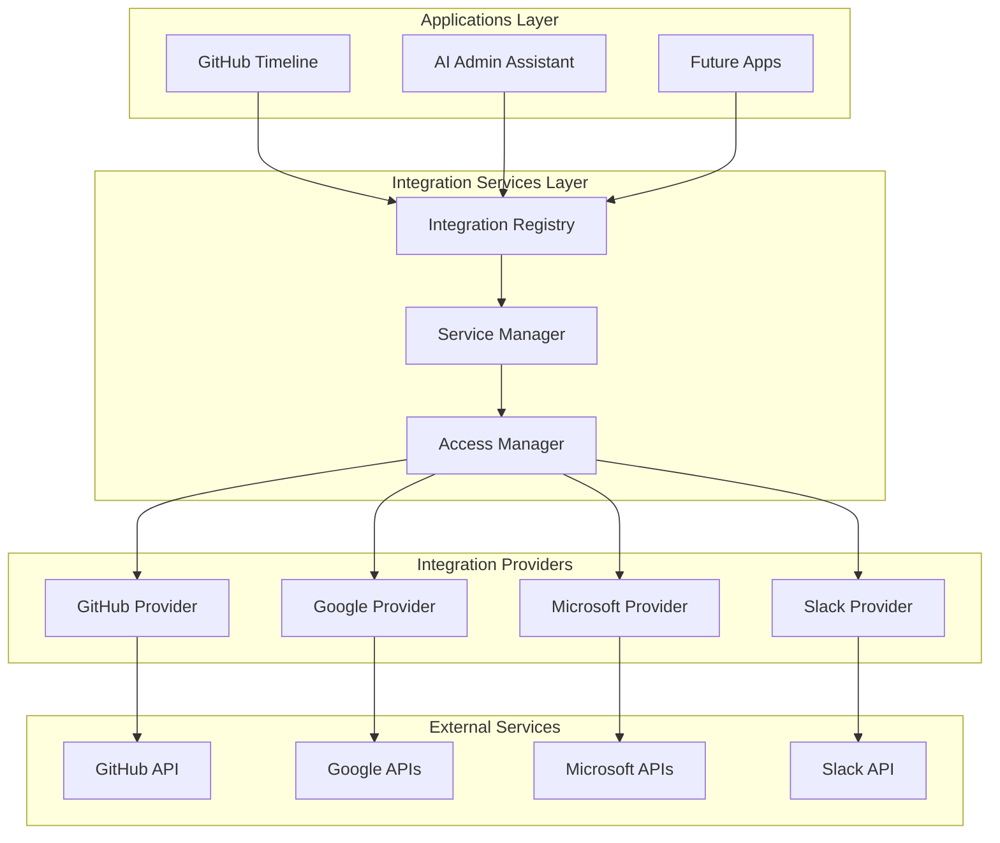

# Shared Integration Services Architecture

**Date:** August 13, 2025  
**Status:** Design Document  
**Purpose:** Enable cross-application integration sharing and discovery across backoffice tools

## Problem Statement

The backoffice platform currently has isolated integrations:
- GitHub Timeline: Direct GitHub API integration
- AI Admin Assistant: Google Drive/Gmail API integration
- Future tools: Each implementing their own external service connections

**Issues:**
- ❌ Duplicate OAuth flows across applications
- ❌ Inconsistent rate limiting and error handling
- ❌ No cross-application data sharing (e.g., GitHub issues in AI Assistant)
- ❌ Manual integration discovery and setup per application
- ❌ Scattered API credentials and token management

**Goals:**
- ✅ Centralized integration registry with capability discovery
- ✅ Shared OAuth and API client management
- ✅ Cross-application data access with proper permissions
- ✅ Unified rate limiting and error handling
- ✅ Plugin-based architecture for easy integration additions

## Architecture Overview

### Core Components



## Implementation Strategy

### Phase 1: Integration Registry & Discovery System

#### 1.1 Integration Registry Schema

```typescript
// src/lib/integrations/registry.ts
export interface IntegrationProvider {
  id: string;                          // 'github', 'google', 'microsoft'
  name: string;                        // 'GitHub', 'Google Workspace'
  version: string;                     // '1.0.0'
  capabilities: IntegrationCapability[];
  authentication: AuthenticationConfig;
  rateLimit: RateLimitConfig;
  endpoints: EndpointConfig[];
  status: 'active' | 'deprecated' | 'maintenance';
}

export interface IntegrationCapability {
  id: string;                          // 'github.issues', 'google.drive'
  name: string;                        // 'GitHub Issues', 'Google Drive Files'
  description: string;
  dataTypes: string[];                 // ['issue', 'pull_request']
  operations: Operation[];             // ['read', 'write', 'sync']
  permissions: string[];               // ['repo:read', 'drive:read']
  dependencies?: string[];             // ['github.auth']
}

export interface AuthenticationConfig {
  type: 'oauth2' | 'service_account' | 'api_key' | 'personal_token';
  scopes: string[];
  tokenEndpoint?: string;
  refreshSupported: boolean;
  userLevel: boolean;                  // true if per-user auth needed
}

// Registry implementation
export class IntegrationRegistry {
  private providers = new Map<string, IntegrationProvider>();
  private capabilities = new Map<string, IntegrationCapability>();
  
  registerProvider(provider: IntegrationProvider): void;
  getProvider(id: string): IntegrationProvider | undefined;
  getCapability(id: string): IntegrationCapability | undefined;
  findCapabilities(criteria: CapabilityCriteria): IntegrationCapability[];
  getAvailableIntegrations(userPermissions: string[]): IntegrationProvider[];
}
```

#### 1.2 Application Integration Discovery

```typescript
// Update src/lib/applications.ts
export interface BackofficeApp {
  id: string;
  name: string;
  description: string;
  icon: string;
  path: string;
  category: 'development' | 'analytics' | 'operations' | 'ai';
  enabled: boolean;
  requiresPermissions?: string[];
  
  // Enhanced integration specifications
  integrations: {
    required: IntegrationRequirement[];    // Must have these integrations
    optional: IntegrationRequirement[];    // Can use if available
    provides: IntegrationExport[];         // Exposes data to other apps
  };
}

export interface IntegrationRequirement {
  capability: string;                      // 'github.issues', 'google.drive'
  permissions: string[];                   // Required permissions level
  purpose: string;                         // Human-readable purpose
  fallback?: 'disable' | 'limited' | 'error'; // Behavior if unavailable
}

export interface IntegrationExport {
  capability: string;                      // 'timeline.events'
  dataType: string;                       // 'timeline_event'
  endpoint: string;                       // '/api/timeline/events'
  permissions: string[];                  // Who can access this data
}

// Example application definitions
export const applications: BackofficeApp[] = [
  {
    id: 'github-timeline',
    name: 'GitHub Timeline Explorer',
    // ... existing properties
    integrations: {
      required: [
        {
          capability: 'github.issues',
          permissions: ['repo:read'],
          purpose: 'Display issues in timeline',
          fallback: 'disable'
        },
        {
          capability: 'github.pulls',
          permissions: ['repo:read'],
          purpose: 'Display pull requests in timeline',
          fallback: 'disable'
        }
      ],
      optional: [],
      provides: [
        {
          capability: 'timeline.events',
          dataType: 'timeline_event',
          endpoint: '/api/apps/github-timeline/events',
          permissions: ['timeline:read']
        }
      ]
    }
  },
  {
    id: 'ai-admin-assistant',
    name: 'AI Admin Assistant',
    // ... existing properties
    integrations: {
      required: [
        {
          capability: 'google.drive',
          permissions: ['drive:read'],
          purpose: 'Analyze documents for email campaigns',
          fallback: 'disable'
        },
        {
          capability: 'google.gmail',
          permissions: ['gmail:send'],
          purpose: 'Send personalized email campaigns',
          fallback: 'disable'
        },
        {
          capability: 'openai.gpt',
          permissions: ['ai:analyze'],
          purpose: 'Generate AI insights and personalization',
          fallback: 'error'
        }
      ],
      optional: [
        {
          capability: 'github.issues',
          permissions: ['repo:read'],
          purpose: 'Include GitHub tasks in daily summary',
          fallback: 'limited'
        },
        {
          capability: 'timeline.events',
          permissions: ['timeline:read'],
          purpose: 'Provide context from development timeline',
          fallback: 'limited'
        }
      ],
      provides: [
        {
          capability: 'ai.document_analysis',
          dataType: 'document_analysis',
          endpoint: '/api/apps/ai-admin-assistant/analyze',
          permissions: ['ai:read']
        }
      ]
    }
  }
];
```

### Phase 2: Shared Service Manager

#### 2.1 Service Manager Implementation

```typescript
// src/lib/integrations/service-manager.ts
export class ServiceManager {
  private registry: IntegrationRegistry;
  private providers = new Map<string, IntegrationProvider>();
  private clients = new Map<string, any>();
  
  constructor(registry: IntegrationRegistry) {
    this.registry = registry;
  }
  
  // Get a service client for a specific capability
  async getClient<T>(
    capability: string, 
    userContext: UserContext
  ): Promise<ServiceClient<T>> {
    const cap = this.registry.getCapability(capability);
    if (!cap) throw new Error(`Capability ${capability} not found`);
    
    const provider = this.registry.getProvider(cap.providerId);
    if (!provider) throw new Error(`Provider for ${capability} not found`);
    
    // Check user permissions
    const hasPermissions = await this.checkPermissions(
      userContext, 
      cap.permissions
    );
    if (!hasPermissions) {
      throw new Error(`Insufficient permissions for ${capability}`);
    }
    
    // Return cached client or create new one
    const clientKey = `${provider.id}:${userContext.userId}`;
    if (!this.clients.has(clientKey)) {
      const client = await this.createClient(provider, userContext);
      this.clients.set(clientKey, client);
    }
    
    return new ServiceClient(
      this.clients.get(clientKey)!,
      cap,
      userContext
    );
  }
  
  // Discover available capabilities for an application
  async discoverCapabilities(
    appId: string,
    userContext: UserContext
  ): Promise<AvailableCapability[]> {
    const app = getApplicationById(appId);
    if (!app) throw new Error(`Application ${appId} not found`);
    
    const available: AvailableCapability[] = [];
    
    for (const req of [...app.integrations.required, ...app.integrations.optional]) {
      const capability = this.registry.getCapability(req.capability);
      if (!capability) continue;
      
      const hasAuth = await this.hasValidAuthentication(
        capability.providerId, 
        userContext
      );
      const hasPermissions = await this.checkPermissions(
        userContext, 
        req.permissions
      );
      
      available.push({
        ...capability,
        requirement: req,
        available: hasAuth && hasPermissions,
        reason: !hasAuth ? 'authentication_required' : 
                !hasPermissions ? 'permissions_insufficient' : 'available'
      });
    }
    
    return available;
  }
}

export class ServiceClient<T> {
  constructor(
    private client: T,
    private capability: IntegrationCapability,
    private userContext: UserContext
  ) {}
  
  // Wrapped API calls with rate limiting and error handling
  async call<R>(
    method: string,
    params: any,
    options?: CallOptions
  ): Promise<R> {
    // Rate limiting check
    await this.checkRateLimit();
    
    // Audit logging
    await this.logAccess(method, params);
    
    try {
      const result = await (this.client as any)[method](params);
      await this.logSuccess(method, params, result);
      return result;
    } catch (error) {
      await this.logError(method, params, error);
      throw this.wrapError(error);
    }
  }
  
  // Get raw client for complex operations
  getRawClient(): T {
    return this.client;
  }
}
```

#### 2.2 Integration Providers

```typescript
// src/lib/integrations/providers/github.provider.ts
import { IntegrationProvider, IntegrationCapability } from '../registry';
import { Octokit } from '@octokit/rest';

export const githubProvider: IntegrationProvider = {
  id: 'github',
  name: 'GitHub',
  version: '1.0.0',
  status: 'active',
  authentication: {
    type: 'personal_token',
    scopes: ['repo:read', 'user:read'],
    refreshSupported: false,
    userLevel: true
  },
  rateLimit: {
    requests: 5000,
    window: 3600, // 1 hour
    burst: 60
  },
  capabilities: [
    {
      id: 'github.issues',
      name: 'GitHub Issues',
      description: 'Access GitHub repository issues',
      dataTypes: ['issue'],
      operations: ['read', 'sync'],
      permissions: ['repo:read']
    },
    {
      id: 'github.pulls',
      name: 'GitHub Pull Requests', 
      description: 'Access GitHub pull requests',
      dataTypes: ['pull_request'],
      operations: ['read', 'sync'],
      permissions: ['repo:read']
    },
    {
      id: 'github.user_issues',
      name: 'GitHub User Issues',
      description: 'Get issues assigned to authenticated user',
      dataTypes: ['user_issue'],
      operations: ['read'],
      permissions: ['repo:read', 'user:read']
    }
  ],
  endpoints: [
    {
      capability: 'github.user_issues',
      method: 'GET',
      path: '/search/issues',
      params: { q: 'assignee:{username} is:open' }
    }
  ]
};

export class GitHubService {
  private octokit: Octokit;
  
  constructor(token: string) {
    this.octokit = new Octokit({ auth: token });
  }
  
  async getUserIssues(username: string): Promise<UserIssue[]> {
    const { data } = await this.octokit.search.issuesAndPullRequests({
      q: `assignee:${username} is:open type:issue`,
      sort: 'updated',
      order: 'desc'
    });
    
    return data.items.map(issue => ({
      id: issue.id,
      number: issue.number,
      title: issue.title,
      repository: issue.repository_url.split('/').pop(),
      url: issue.html_url,
      updatedAt: issue.updated_at
    }));
  }
  
  async getRepositoryIssues(
    owner: string, 
    repo: string, 
    options?: IssueOptions
  ): Promise<Issue[]> {
    const { data } = await this.octokit.issues.listForRepo({
      owner,
      repo,
      state: options?.state || 'all',
      per_page: options?.limit || 50
    });
    
    return data.map(issue => ({
      id: issue.id,
      number: issue.number,
      title: issue.title,
      body: issue.body,
      state: issue.state,
      author: issue.user?.login,
      labels: issue.labels.map(l => typeof l === 'string' ? l : l.name),
      createdAt: issue.created_at,
      updatedAt: issue.updated_at
    }));
  }
}
```

```typescript
// src/lib/integrations/providers/google.provider.ts
export const googleProvider: IntegrationProvider = {
  id: 'google',
  name: 'Google Workspace',
  version: '1.0.0',
  status: 'active',
  authentication: {
    type: 'oauth2',
    scopes: [
      'https://www.googleapis.com/auth/drive',
      'https://www.googleapis.com/auth/gmail.modify',
      'https://www.googleapis.com/auth/calendar.readonly'
    ],
    tokenEndpoint: 'https://oauth2.googleapis.com/token',
    refreshSupported: true,
    userLevel: true
  },
  capabilities: [
    {
      id: 'google.drive',
      name: 'Google Drive Files',
      description: 'Access and analyze Google Drive documents',
      dataTypes: ['drive_file', 'document_content'],
      operations: ['read', 'analyze'],
      permissions: ['drive:read']
    },
    {
      id: 'google.gmail',
      name: 'Gmail',
      description: 'Send and manage Gmail messages',
      dataTypes: ['email', 'draft'],
      operations: ['read', 'write', 'send'],
      permissions: ['gmail:send', 'gmail:read']
    }
  ]
};

export class GoogleService {
  constructor(
    private accessToken: string,
    private refreshToken?: string
  ) {}
  
  async getDriveFiles(options?: DriveListOptions): Promise<DriveFile[]> {
    // Implementation using Google Drive API
  }
  
  async getDocumentContent(fileId: string): Promise<string> {
    // Implementation using Google Drive API
  }
  
  async sendEmail(email: EmailMessage): Promise<{ messageId: string }> {
    // Implementation using Gmail API
  }
}
```

### Phase 3: Cross-Application Data Sharing

#### 3.1 Data Access Layer

```typescript
// src/lib/integrations/data-access.ts
export interface DataAccessRequest {
  capability: string;              // 'github.user_issues'
  requestingApp: string;           // 'ai-admin-assistant'
  userContext: UserContext;
  parameters?: any;
  cacheOptions?: CacheOptions;
}

export class CrossAppDataAccess {
  constructor(
    private serviceManager: ServiceManager,
    private permissionManager: PermissionManager
  ) {}
  
  async getData<T>(request: DataAccessRequest): Promise<T> {
    // 1. Validate requesting application permissions
    await this.validateAppPermissions(request);
    
    // 2. Check user permissions for the capability
    await this.validateUserPermissions(request);
    
    // 3. Get service client
    const client = await this.serviceManager.getClient(
      request.capability,
      request.userContext
    );
    
    // 4. Check cache if enabled
    if (request.cacheOptions?.enabled) {
      const cached = await this.getFromCache<T>(request);
      if (cached) return cached;
    }
    
    // 5. Fetch data
    const data = await this.fetchData<T>(client, request);
    
    // 6. Cache result if configured
    if (request.cacheOptions?.enabled) {
      await this.cacheData(request, data);
    }
    
    // 7. Audit log the access
    await this.auditDataAccess(request, data);
    
    return data;
  }
  
  private async validateAppPermissions(request: DataAccessRequest): Promise<void> {
    const app = getApplicationById(request.requestingApp);
    if (!app) throw new Error(`Unknown application: ${request.requestingApp}`);
    
    const hasRequirement = [
      ...app.integrations.required,
      ...app.integrations.optional
    ].some(req => req.capability === request.capability);
    
    if (!hasRequirement) {
      throw new Error(
        `Application ${request.requestingApp} not authorized for ${request.capability}`
      );
    }
  }
}
```

#### 3.2 Example Integration Usage

```typescript
// Example: AI Admin Assistant accessing GitHub issues
// src/app/apps/ai-admin-assistant/lib/github-integration.ts
import { CrossAppDataAccess } from '@/lib/integrations/data-access';
import { useUser } from '@/lib/auth';

export class AIAssistantGitHubIntegration {
  constructor(private dataAccess: CrossAppDataAccess) {}
  
  async getUserIssuesForDailySummary(
    userContext: UserContext
  ): Promise<GitHubIssue[]> {
    try {
      const issues = await this.dataAccess.getData<GitHubIssue[]>({
        capability: 'github.user_issues',
        requestingApp: 'ai-admin-assistant',
        userContext,
        parameters: {
          username: userContext.githubUsername,
          state: 'open'
        },
        cacheOptions: {
          enabled: true,
          ttl: 300 // 5 minutes
        }
      });
      
      return issues;
    } catch (error) {
      // Handle gracefully - this is an optional integration
      console.warn('GitHub integration unavailable:', error.message);
      return [];
    }
  }
  
  async includeGitHubContextInEmail(
    documentAnalysis: DocumentAnalysis,
    userContext: UserContext
  ): Promise<DocumentAnalysis> {
    const issues = await this.getUserIssuesForDailySummary(userContext);
    
    if (issues.length > 0) {
      return {
        ...documentAnalysis,
        additionalContext: {
          ...documentAnalysis.additionalContext,
          activeGitHubIssues: issues.map(issue => ({
            title: issue.title,
            repository: issue.repository,
            priority: this.calculateIssuePriority(issue)
          }))
        }
      };
    }
    
    return documentAnalysis;
  }
}
```

### Phase 4: Implementation Plan

#### 4.1 Database Schema Extensions

```sql
-- Integration registry and user connections
CREATE TABLE integration_providers (
  id VARCHAR(50) PRIMARY KEY,
  name VARCHAR(255) NOT NULL,
  version VARCHAR(20) NOT NULL,
  config JSONB NOT NULL,
  status VARCHAR(20) DEFAULT 'active',
  created_at TIMESTAMP DEFAULT CURRENT_TIMESTAMP,
  updated_at TIMESTAMP DEFAULT CURRENT_TIMESTAMP
);

CREATE TABLE user_integrations (
  id SERIAL PRIMARY KEY,
  user_email VARCHAR(255) NOT NULL,
  provider_id VARCHAR(50) NOT NULL REFERENCES integration_providers(id),
  credentials_encrypted TEXT, -- Encrypted OAuth tokens/API keys
  scopes TEXT[] NOT NULL,
  expires_at TIMESTAMP,
  created_at TIMESTAMP DEFAULT CURRENT_TIMESTAMP,
  last_used TIMESTAMP,
  UNIQUE(user_email, provider_id)
);

CREATE TABLE integration_usage_logs (
  id SERIAL PRIMARY KEY,
  user_email VARCHAR(255) NOT NULL,
  app_id VARCHAR(50) NOT NULL,
  capability VARCHAR(100) NOT NULL,
  provider_id VARCHAR(50) NOT NULL,
  operation VARCHAR(50) NOT NULL,
  success BOOLEAN NOT NULL,
  response_time_ms INTEGER,
  error_message TEXT,
  created_at TIMESTAMP DEFAULT CURRENT_TIMESTAMP
);

-- Data sharing permissions
CREATE TABLE app_integration_permissions (
  id SERIAL PRIMARY KEY,
  app_id VARCHAR(50) NOT NULL,
  capability VARCHAR(100) NOT NULL,
  permission_level VARCHAR(20) NOT NULL, -- 'read', 'write', 'admin'
  auto_approved BOOLEAN DEFAULT FALSE,
  created_at TIMESTAMP DEFAULT CURRENT_TIMESTAMP
);
```

#### 4.2 API Routes for Integration Management

```typescript
// src/app/api/integrations/route.ts
export async function GET(req: NextRequest) {
  const user = await auth();
  if (!user?.user?.email) {
    return NextResponse.json({ error: 'Unauthorized' }, { status: 401 });
  }
  
  const serviceManager = new ServiceManager(registry);
  const userContext = { userId: user.user.id, email: user.user.email };
  
  // Get available integrations for user
  const providers = registry.getAvailableIntegrations(userContext.permissions || []);
  
  // Check which ones user has configured
  const userIntegrations = await getUserIntegrations(user.user.email);
  
  const integrations = providers.map(provider => ({
    ...provider,
    configured: userIntegrations.has(provider.id),
    lastUsed: userIntegrations.get(provider.id)?.lastUsed
  }));
  
  return NextResponse.json({ integrations });
}

// src/app/api/integrations/[providerId]/auth/route.ts
export async function POST(
  req: NextRequest,
  { params }: { params: { providerId: string } }
) {
  // Handle OAuth callback or API key setup for specific provider
}

// src/app/api/integrations/capabilities/route.ts
export async function GET(req: NextRequest) {
  const { searchParams } = new URL(req.url);
  const appId = searchParams.get('app');
  
  if (!appId) {
    return NextResponse.json({ error: 'app parameter required' }, { status: 400 });
  }
  
  const user = await auth();
  const userContext = { userId: user.user.id, email: user.user.email };
  
  const serviceManager = new ServiceManager(registry);
  const capabilities = await serviceManager.discoverCapabilities(appId, userContext);
  
  return NextResponse.json({ capabilities });
}
```

#### 4.3 React Components for Integration Management

```typescript
// src/components/integrations/IntegrationManager.tsx
export const IntegrationManager: React.FC<{ appId: string }> = ({ appId }) => {
  const [capabilities, setCapabilities] = useState<AvailableCapability[]>([]);
  const [loading, setLoading] = useState(true);
  
  useEffect(() => {
    fetch(`/api/integrations/capabilities?app=${appId}`)
      .then(res => res.json())
      .then(data => {
        setCapabilities(data.capabilities);
        setLoading(false);
      });
  }, [appId]);
  
  return (
    <Card className="p-6">
      <h3 className="text-lg font-semibold mb-4">Required Integrations</h3>
      
      {capabilities.map(capability => (
        <IntegrationCard
          key={capability.id}
          capability={capability}
          onConnect={handleConnect}
          onDisconnect={handleDisconnect}
        />
      ))}
    </Card>
  );
};

// src/components/integrations/IntegrationCard.tsx
export const IntegrationCard: React.FC<{
  capability: AvailableCapability;
  onConnect: (capabilityId: string) => void;
  onDisconnect: (capabilityId: string) => void;
}> = ({ capability, onConnect, onDisconnect }) => {
  const isRequired = capability.requirement.fallback === 'disable' || 
                    capability.requirement.fallback === 'error';
  
  return (
    <Card className={cn(
      "p-4 mb-3",
      !capability.available && isRequired && "border-red-200 bg-red-50"
    )}>
      <div className="flex items-center justify-between">
        <div>
          <h4 className="font-medium">{capability.name}</h4>
          <p className="text-sm text-gray-600">{capability.description}</p>
          <p className="text-xs text-gray-500 mt-1">
            Purpose: {capability.requirement.purpose}
          </p>
        </div>
        
        <div className="flex items-center gap-2">
          <Badge variant={capability.available ? "default" : "destructive"}>
            {capability.available ? "Connected" : capability.reason}
          </Badge>
          
          {capability.available ? (
            <Button
              size="sm"
              variant="outline"
              onClick={() => onDisconnect(capability.id)}
            >
              Disconnect
            </Button>
          ) : (
            <Button
              size="sm"
              onClick={() => onConnect(capability.id)}
            >
              Connect
            </Button>
          )}
        </div>
      </div>
    </Card>
  );
};
```

## Benefits of This Architecture

### ✅ **Immediate Benefits**
1. **Unified OAuth Management**: Single authentication flow per service across all applications
2. **Cross-App Data Access**: GitHub issues in AI Assistant, Google Drive analysis in other tools
3. **Consistent Error Handling**: Standardized rate limiting and error responses
4. **Capability Discovery**: Applications automatically discover available integrations
5. **Security & Auditing**: Comprehensive logging and permission management

### ✅ **Long-term Benefits**
1. **Easy Integration Addition**: Plugin-based architecture for new services
2. **Reduced Development Time**: Shared clients and authentication flows
3. **Better User Experience**: Single setup for integrations used across multiple apps
4. **Compliance & Governance**: Centralized audit trails and permission controls
5. **Performance Optimization**: Shared caching and connection pooling

## Implementation Timeline

### **Phase 1 (Weeks 1-2): Foundation**
- Integration registry and discovery system
- Database schema and basic API routes
- Update application definitions with integration requirements

### **Phase 2 (Weeks 3-4): Service Manager**
- Implement ServiceManager and client wrapper classes
- Create GitHub and Google integration providers
- Build basic cross-app data access layer

### **Phase 3 (Weeks 5-6): User Interface**
- Integration management UI components
- OAuth flow handling for each provider
- Application integration setup pages

### **Phase 4 (Weeks 7-8): Cross-App Features**
- Implement AI Assistant GitHub integration
- Enable Google Drive access for other applications
- Testing and optimization

This architecture provides a solid foundation for scalable, secure, and maintainable integration sharing across your backoffice platform while maintaining the flexibility to add new integrations and applications easily.