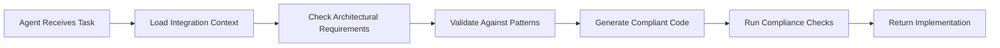

# Claude Code Agent Integration Guidance System

**Date:** August 13, 2025  
**Purpose:** Ensure all Claude Code agents and sub-agents incorporate shared integration architecture guidance  
**Status:** Active Implementation Guide

## Overview

This document establishes how Claude Code agents will automatically incorporate architectural guidance from the shared integrations artifacts into their implementation decisions and code generation.

## Core Integration Artifacts

### Primary Reference Documents
1. **Architectural Blueprint**: `_docs/architecture/shared-integrations-architecture.md`
2. **Implementation Guide**: `_docs/implementation-guides/shared-integrations-implementation-guide.md`
3. **Technical Standards**: This document and related compliance guides

## Agent Integration Strategies

### 1. Context-Aware Agent Prompting

#### For All Specialist Agents
All sub-agents should receive contextual guidance through enhanced prompts that reference the architectural artifacts:

```markdown
## Architectural Context for {AGENT_TYPE}

Before implementing any integration-related functionality, consult these architectural guidelines:

### Integration Architecture References
- **Shared Integration Architecture**: `_docs/architecture/shared-integrations-architecture.md`
- **Implementation Patterns**: `_docs/implementation-guides/shared-integrations-implementation-guide.md`

### Key Architectural Principles for {AGENT_TYPE}
{AGENT_SPECIFIC_PRINCIPLES}

### Implementation Requirements
{AGENT_SPECIFIC_REQUIREMENTS}

### Validation Checklist
{AGENT_SPECIFIC_CHECKLIST}
```

#### Agent-Specific Integration Guidelines

##### **nodejs-specialist** Integration Requirements
```markdown
## Backend Integration Requirements

### MUST DO - Integration Architecture Compliance
1. **Use Integration Registry**: Always check `registry.getCapability(capabilityId)` before implementing direct API calls
2. **Follow Service Manager Pattern**: Use `ServiceManager.getClient()` instead of direct API client instantiation
3. **Implement Rate Limiting**: Use `ServiceClient.call()` wrapper for all external API calls
4. **Add Audit Logging**: Every integration call must log through `IntegrationUsageLog`

### Integration Client Pattern
```typescript
// ✅ CORRECT - Use integration registry
import { registry } from '@/lib/integrations/registry';
import { ServiceManager } from '@/lib/integrations/service-manager';

const client = await serviceManager.getClient('github.issues', userContext);
const issues = await client.call('getRepositoryIssues', { owner, repo });

// ❌ WRONG - Direct API client
import { Octokit } from '@octokit/rest';
const octokit = new Octokit({ auth: token });
```

### Required Imports
```typescript
import { registry } from '@/lib/integrations/registry';
import { integrationClient } from '@/lib/integrations/client';
import { CrossAppDataAccess } from '@/lib/integrations/data-access';
```

### API Route Implementation Pattern
```typescript
// All integration API routes MUST follow this pattern
export async function GET(req: NextRequest) {
  const session = await auth();
  if (!session?.user?.email) {
    return NextResponse.json({ error: 'Unauthorized' }, { status: 401 });
  }

  // REQUIRED: Check integration capability
  const capability = registry.getCapability(req.capability);
  if (!capability) {
    return NextResponse.json({ error: 'Capability not found' }, { status: 404 });
  }

  // REQUIRED: Validate user integration status
  const status = await getUserIntegrationStatus(session.user.email, capability.providerId);
  if (!status.connected) {
    return NextResponse.json({ error: 'Integration not configured' }, { status: 400 });
  }

  // REQUIRED: Use service client wrapper
  const client = await serviceManager.getClient(req.capability, userContext);
  const result = await client.call(methodName, params);
  
  return NextResponse.json(result);
}
```
```

##### **react-component-architect** Integration Requirements
```markdown
## Frontend Integration Requirements

### MUST DO - Component Integration Patterns
1. **Use Integration Hooks**: Always use `useIntegrationStatus()` hook for integration state
2. **Handle Integration Loading States**: Show loading/error states for integration-dependent features
3. **Follow Integration UI Patterns**: Use `IntegrationCard` and `IntegrationSetup` components
4. **Implement Graceful Degradation**: Components must work with optional integrations disabled

### Required Component Patterns
```tsx
// ✅ CORRECT - Integration-aware component
import { useIntegrationStatus } from '@/hooks/useIntegrationStatus';
import { integrationClient } from '@/lib/integrations/client';

export function MyComponent({ appId }: { appId: string }) {
  const { integrations, loading } = useIntegrationStatus(appId);
  
  const githubIntegration = integrations.find(i => i.capability === 'github.user_issues');
  
  if (!githubIntegration?.available) {
    return <IntegrationRequiredCard capability="github.user_issues" />;
  }
  
  return <IntegrationEnabledView />;
}

// ❌ WRONG - Direct integration check
export function MyComponent() {
  const [hasGithub, setHasGithub] = useState(false);
  
  useEffect(() => {
    // Direct check without using integration registry
    checkGitHubAccess().then(setHasGithub);
  }, []);
}
```

### Required Component Structure
```tsx
interface IntegrationAwareComponentProps {
  appId: string;  // REQUIRED: For integration discovery
  capabilities?: string[];  // Optional: Specific capabilities needed
}

export function IntegrationAwareComponent({ 
  appId, 
  capabilities = [] 
}: IntegrationAwareComponentProps) {
  const { integrations, loading, error } = useIntegrationStatus(appId);
  
  if (loading) return <IntegrationLoadingState />;
  if (error) return <IntegrationErrorState error={error} />;
  
  const requiredIntegrations = capabilities.length > 0 
    ? integrations.filter(i => capabilities.includes(i.capability))
    : integrations.filter(i => i.requirement.fallback !== 'limited');
    
  const missingRequired = requiredIntegrations.filter(i => !i.available);
  
  if (missingRequired.length > 0) {
    return <IntegrationSetup appId={appId} missingIntegrations={missingRequired} />;
  }
  
  return <ComponentWithIntegrationsEnabled integrations={integrations} />;
}
```
```

##### **account-auth-specialist** Integration Requirements
```markdown
## Authentication Integration Requirements

### MUST DO - OAuth and Token Management
1. **Use Centralized Token Storage**: Always use `user_integrations` table via auth-manager
2. **Implement Token Refresh**: Handle OAuth token refresh automatically
3. **Add Integration Audit**: Log all authentication events through `integration_usage_logs`
4. **Validate Integration Scopes**: Check user has required scopes before granting access

### Required Authentication Patterns
```typescript
// ✅ CORRECT - Centralized auth management
import { getUserIntegrationStatus, saveUserIntegration } from '@/lib/integrations/auth-manager';

export async function handleOAuthCallback(providerId: string, tokens: OAuthTokens, userEmail: string) {
  // REQUIRED: Save through centralized manager
  await saveUserIntegration(
    userEmail,
    providerId,
    JSON.stringify(tokens), // Encrypt in production
    tokens.scopes,
    new Date(Date.now() + tokens.expires_in * 1000)
  );
  
  // REQUIRED: Log authentication event
  await logIntegrationUsage({
    userEmail,
    appId: 'auth',
    capability: `${providerId}.auth`,
    providerId,
    operation: 'oauth_callback',
    success: true
  });
}

// ❌ WRONG - Direct token storage
const tokens = { access_token: 'xxx' };
localStorage.setItem('github_token', tokens.access_token);
```

### Required Auth Validation Pattern
```typescript
export async function validateIntegrationAccess(
  userEmail: string,
  capability: string,
  requiredScopes: string[]
): Promise<{ valid: boolean; reason?: string }> {
  
  const cap = registry.getCapability(capability);
  if (!cap) return { valid: false, reason: 'capability_not_found' };
  
  const status = await getUserIntegrationStatus(userEmail, cap.providerId);
  if (!status.connected) return { valid: false, reason: 'not_connected' };
  
  // Check if user has required scopes
  const userIntegration = await getUserIntegration(userEmail, cap.providerId);
  const hasRequiredScopes = requiredScopes.every(scope => 
    userIntegration.scopes.includes(scope)
  );
  
  if (!hasRequiredScopes) return { valid: false, reason: 'insufficient_scopes' };
  
  return { valid: true };
}
```
```

##### **database-architect** Integration Requirements
```markdown
## Database Integration Requirements

### MUST DO - Schema Integration Compliance
1. **Use Integration Tables**: Always reference `user_integrations`, `integration_providers` tables
2. **Follow Foreign Key Patterns**: Link app data to user integrations properly
3. **Implement Audit Schema**: Add integration usage tracking to all schemas
4. **Add Integration Metadata**: Include integration context in data models

### Required Schema Patterns
```sql
-- ✅ CORRECT - Integration-aware table design
CREATE TABLE app_specific_data (
  id SERIAL PRIMARY KEY,
  user_email VARCHAR(255) NOT NULL,
  integration_provider_id VARCHAR(50) REFERENCES integration_providers(id),
  external_resource_id VARCHAR(255), -- GitHub issue ID, Google file ID, etc.
  data JSONB NOT NULL,
  created_at TIMESTAMP DEFAULT CURRENT_TIMESTAMP,
  
  -- REQUIRED: Composite index for integration queries
  INDEX idx_app_integration_user (user_email, integration_provider_id),
  INDEX idx_app_external_resource (integration_provider_id, external_resource_id)
);

-- REQUIRED: Audit trail for all integration-related data changes
CREATE TABLE app_specific_audit (
  id SERIAL PRIMARY KEY,
  app_data_id INTEGER REFERENCES app_specific_data(id),
  user_email VARCHAR(255) NOT NULL,
  action VARCHAR(50) NOT NULL,
  integration_capability VARCHAR(100),
  old_data JSONB,
  new_data JSONB,
  timestamp TIMESTAMP DEFAULT CURRENT_TIMESTAMP
);
```

### Required Migration Pattern
```typescript
// All migrations must check for integration dependencies
export async function up(sql: any): Promise<void> {
  // REQUIRED: Check if integration tables exist
  const integrationTablesExist = await sql`
    SELECT EXISTS (
      SELECT FROM information_schema.tables 
      WHERE table_name = 'user_integrations'
    )`;
    
  if (!integrationTablesExist[0].exists) {
    throw new Error('Integration tables must be created first. Run integration migration.');
  }
  
  // Proceed with app-specific schema changes
}
```
```

### 2. Dynamic Context Injection

#### Implementation Strategy
```typescript
// Enhanced agent prompting system
interface AgentContext {
  architecturalGuidelines: ArchitecturalGuideline[];
  integrationRequirements: IntegrationRequirement[];
  implementationPatterns: CodePattern[];
  validationChecks: ValidationCheck[];
}

interface ArchitecturalGuideline {
  agentType: string;
  principle: string;
  requirement: string;
  examples: CodeExample[];
  antiPatterns: CodeExample[];
}

// Context injection for each agent type
const getAgentIntegrationContext = (agentType: string): AgentContext => {
  return {
    architecturalGuidelines: loadGuidelinesForAgent(agentType),
    integrationRequirements: loadRequirementsForAgent(agentType),
    implementationPatterns: loadPatternsForAgent(agentType),
    validationChecks: loadValidationForAgent(agentType)
  };
};
```

### 3. Automated Compliance Validation

#### Code Review Integration
```typescript
// Automated validation for integration compliance
interface IntegrationComplianceCheck {
  rule: string;
  severity: 'error' | 'warning' | 'info';
  message: string;
  suggestion: string;
  autoFix?: string;
}

const integrationComplianceRules: IntegrationComplianceCheck[] = [
  {
    rule: 'no-direct-api-clients',
    severity: 'error',
    message: 'Direct API clients detected. Use ServiceManager.getClient() instead.',
    suggestion: 'Replace direct API client instantiation with integration registry pattern',
    autoFix: 'const client = await serviceManager.getClient(capability, userContext);'
  },
  {
    rule: 'missing-integration-audit',
    severity: 'warning', 
    message: 'Integration call without audit logging detected.',
    suggestion: 'Add integration usage logging for compliance',
    autoFix: 'await logIntegrationUsage({ userEmail, appId, capability, operation });'
  },
  {
    rule: 'missing-rate-limiting',
    severity: 'error',
    message: 'External API call without rate limiting wrapper.',
    suggestion: 'Use ServiceClient.call() method for rate limiting',
    autoFix: 'const result = await client.call(methodName, params);'
  }
];
```

### 4. Agent-Specific Implementation Guidance

#### Enhanced Agent Prompts

##### **For nodejs-specialist:**
```markdown
## Integration Architecture Compliance for Backend Development

### CRITICAL: Before implementing any external API integration:
1. **Check Integration Registry**: `const capability = registry.getCapability('service.feature')`
2. **Use Service Manager**: `const client = await serviceManager.getClient(capability, userContext)`
3. **Add Rate Limiting**: `const result = await client.call(method, params)`
4. **Log Usage**: `await logIntegrationUsage({ userEmail, appId, capability, operation })`

### Code Generation Requirements:
- ✅ Always import from `@/lib/integrations/` for external service access
- ✅ Wrap all external API calls with ServiceClient
- ✅ Add comprehensive error handling with integration fallbacks
- ✅ Include audit logging for all external service interactions
- ❌ Never create direct API clients (Octokit, Google APIs, etc.)
- ❌ Never hardcode external service URLs or endpoints
- ❌ Never skip rate limiting for bulk operations

### Required Code Pattern:
```typescript
// REQUIRED IMPORTS
import { registry } from '@/lib/integrations/registry';
import { serviceManager } from '@/lib/integrations/service-manager';
import { logIntegrationUsage } from '@/lib/integrations/audit';

// REQUIRED IMPLEMENTATION PATTERN
export async function integratedFunction(userContext: UserContext) {
  const capability = registry.getCapability('service.feature');
  if (!capability) throw new IntegrationNotFoundError('service.feature');
  
  const client = await serviceManager.getClient('service.feature', userContext);
  const result = await client.call('methodName', params, options);
  
  await logIntegrationUsage({
    userEmail: userContext.email,
    appId: 'current-app',
    capability: 'service.feature',
    operation: 'methodName',
    success: true
  });
  
  return result;
}
```
```

##### **For react-component-architect:**
```markdown
## Integration Architecture Compliance for Frontend Development

### CRITICAL: Before creating any component that uses external services:
1. **Use Integration Hooks**: `const { integrations } = useIntegrationStatus(appId)`
2. **Handle Loading States**: Show proper loading/error states for integrations
3. **Implement Fallbacks**: Components must work with optional integrations disabled
4. **Follow UI Patterns**: Use existing IntegrationCard, IntegrationSetup components

### Component Generation Requirements:
- ✅ Always use `useIntegrationStatus` hook for integration state
- ✅ Import and use existing integration UI components
- ✅ Handle graceful degradation for optional integrations
- ✅ Show integration setup prompts for missing required integrations
- ❌ Never directly check for external service availability
- ❌ Never create custom integration status checking logic
- ❌ Never ignore integration loading/error states

### Required Component Pattern:
```tsx
// REQUIRED IMPORTS
import { useIntegrationStatus } from '@/hooks/useIntegrationStatus';
import { IntegrationSetup } from '@/components/integrations/IntegrationSetup';
import { IntegrationCard } from '@/components/integrations/IntegrationCard';

// REQUIRED COMPONENT PATTERN
interface Props {
  appId: string;
  requiredCapabilities?: string[];
}

export function IntegrationAwareComponent({ appId, requiredCapabilities = [] }: Props) {
  const { integrations, loading, error } = useIntegrationStatus(appId);
  
  if (loading) return <div>Loading integrations...</div>;
  if (error) return <div>Integration error: {error.message}</div>;
  
  const requiredIntegrations = requiredCapabilities.length > 0
    ? integrations.filter(i => requiredCapabilities.includes(i.capability))
    : integrations.filter(i => i.requirement.fallback !== 'limited');
    
  const missingRequired = requiredIntegrations.filter(i => !i.available);
  
  if (missingRequired.length > 0) {
    return <IntegrationSetup appId={appId} missingIntegrations={missingRequired} />;
  }
  
  return <ComponentContent integrations={integrations} />;
}
```
```

##### **For database-architect:**
```markdown
## Integration Architecture Compliance for Database Development

### CRITICAL: Before designing any schema that involves external data:
1. **Reference Integration Tables**: Link to `user_integrations`, `integration_providers`
2. **Add Integration Metadata**: Include provider_id, external_resource_id fields
3. **Implement Audit Trail**: Add integration usage tracking
4. **Follow Foreign Key Patterns**: Proper referential integrity

### Schema Generation Requirements:
- ✅ Always include foreign keys to integration tables
- ✅ Add integration-specific indexes for performance
- ✅ Include audit trails for integration-driven data changes
- ✅ Add external resource ID tracking fields
- ❌ Never create integration-unaware schemas for external data
- ❌ Never skip foreign key constraints to integration tables
- ❌ Never omit audit trails for external data operations

### Required Schema Pattern:
```sql
-- REQUIRED INTEGRATION-AWARE SCHEMA
CREATE TABLE app_feature_data (
  id SERIAL PRIMARY KEY,
  user_email VARCHAR(255) NOT NULL,
  integration_provider_id VARCHAR(50) REFERENCES integration_providers(id),
  external_resource_id VARCHAR(255) NOT NULL,
  external_resource_type VARCHAR(50) NOT NULL,
  data JSONB NOT NULL,
  last_sync TIMESTAMP DEFAULT CURRENT_TIMESTAMP,
  created_at TIMESTAMP DEFAULT CURRENT_TIMESTAMP,
  updated_at TIMESTAMP DEFAULT CURRENT_TIMESTAMP,
  
  UNIQUE(integration_provider_id, external_resource_id),
  INDEX idx_user_integration (user_email, integration_provider_id),
  INDEX idx_external_resource (integration_provider_id, external_resource_id),
  INDEX idx_sync_time (last_sync)
);

-- REQUIRED AUDIT TRAIL
CREATE TABLE app_feature_audit (
  id SERIAL PRIMARY KEY,
  app_data_id INTEGER REFERENCES app_feature_data(id),
  user_email VARCHAR(255) NOT NULL,
  integration_capability VARCHAR(100) NOT NULL,
  action VARCHAR(50) NOT NULL,
  external_operation VARCHAR(100),
  success BOOLEAN NOT NULL,
  error_details JSONB,
  timestamp TIMESTAMP DEFAULT CURRENT_TIMESTAMP
);
```
```

### 5. Implementation Monitoring and Validation

#### Automated Architecture Compliance Checking
```typescript
// Integration compliance validation system
class IntegrationComplianceValidator {
  validateNodeJSImplementation(code: string): ComplianceResult {
    const violations: ComplianceViolation[] = [];
    
    // Check for direct API client usage
    if (this.hasDirectAPIClients(code)) {
      violations.push({
        rule: 'no-direct-api-clients',
        severity: 'error',
        line: this.findDirectAPIClientLine(code),
        message: 'Use ServiceManager.getClient() instead of direct API clients'
      });
    }
    
    // Check for missing audit logging
    if (this.hasMissingAuditLogging(code)) {
      violations.push({
        rule: 'missing-audit-logging',
        severity: 'warning',
        line: this.findMissingAuditLine(code),
        message: 'Add integration usage logging for compliance'
      });
    }
    
    return {
      compliant: violations.filter(v => v.severity === 'error').length === 0,
      violations
    };
  }
  
  validateReactImplementation(code: string): ComplianceResult {
    const violations: ComplianceViolation[] = [];
    
    // Check for integration hook usage
    if (this.hasMissingIntegrationHooks(code)) {
      violations.push({
        rule: 'missing-integration-hooks',
        severity: 'error',
        message: 'Use useIntegrationStatus hook for integration state'
      });
    }
    
    return { compliant: violations.length === 0, violations };
  }
}
```

## Agent Integration Workflows

### 1. Pre-Implementation Validation


### 2. Context Loading Mechanism
```typescript
// Enhanced agent context loading
interface AgentIntegrationContext {
  architecturalPatterns: Record<string, CodePattern>;
  complianceRules: ComplianceRule[];
  implementationExamples: CodeExample[];
  validationChecks: ValidationRule[];
}

const loadAgentContext = async (agentType: string): Promise<AgentIntegrationContext> => {
  // Load architectural guidance from documents
  const architecturalDoc = await readFile('_docs/architecture/shared-integrations-architecture.md');
  const implementationDoc = await readFile('_docs/implementation-guides/shared-integrations-implementation-guide.md');
  
  // Parse and extract agent-specific guidance
  const patterns = extractPatternsForAgent(architecturalDoc, agentType);
  const rules = extractRulesForAgent(implementationDoc, agentType);
  
  return {
    architecturalPatterns: patterns,
    complianceRules: rules,
    implementationExamples: extractExamplesForAgent(implementationDoc, agentType),
    validationChecks: extractValidationForAgent(implementationDoc, agentType)
  };
};
```

### 3. Real-time Guidance Integration
```typescript
// Enhanced agent prompting with integration context
const enhanceAgentPrompt = (basePrompt: string, agentType: string, context: AgentIntegrationContext): string => {
  return `
${basePrompt}

## INTEGRATION ARCHITECTURE REQUIREMENTS

### For ${agentType}:
${context.complianceRules.map(rule => `- ${rule.description}`).join('\n')}

### Required Implementation Patterns:
${Object.entries(context.architecturalPatterns).map(([name, pattern]) => 
  `#### ${name}\n\`\`\`typescript\n${pattern.code}\n\`\`\``
).join('\n\n')}

### Validation Requirements:
${context.validationChecks.map(check => `- [ ] ${check.description}`).join('\n')}

### CRITICAL: Before generating code, ensure:
1. All external service access uses the integration registry pattern
2. Proper audit logging is included for compliance
3. Rate limiting is implemented for external API calls
4. Graceful degradation is handled for optional integrations
`;
};
```

## Summary

This guidance system ensures that **all Claude Code agents automatically incorporate** the shared integration architecture by:

1. **🎯 Context Injection**: Every agent receives integration-specific architectural guidance
2. **🔧 Pattern Enforcement**: Agents must follow established integration patterns
3. **✅ Automated Validation**: Code is checked for integration compliance
4. **📚 Dynamic Learning**: Agents reference live architectural documents
5. **🚦 Real-time Guidance**: Integration requirements are included in all agent prompts

The result is a **self-reinforcing architectural system** where every agent naturally follows the shared integration patterns, ensuring consistency and maintainability across your entire backoffice platform.

<function_calls>
<invoke name="TodoWrite">
<parameter name="todos">[{"id": "1", "content": "Create agent integration guidance system", "status": "completed"}, {"id": "2", "content": "Design context injection mechanisms for architectural artifacts", "status": "completed"}, {"id": "3", "content": "Create agent-specific implementation guidelines", "status": "completed"}, {"id": "4", "content": "Establish architectural compliance validation", "status": "completed"}]